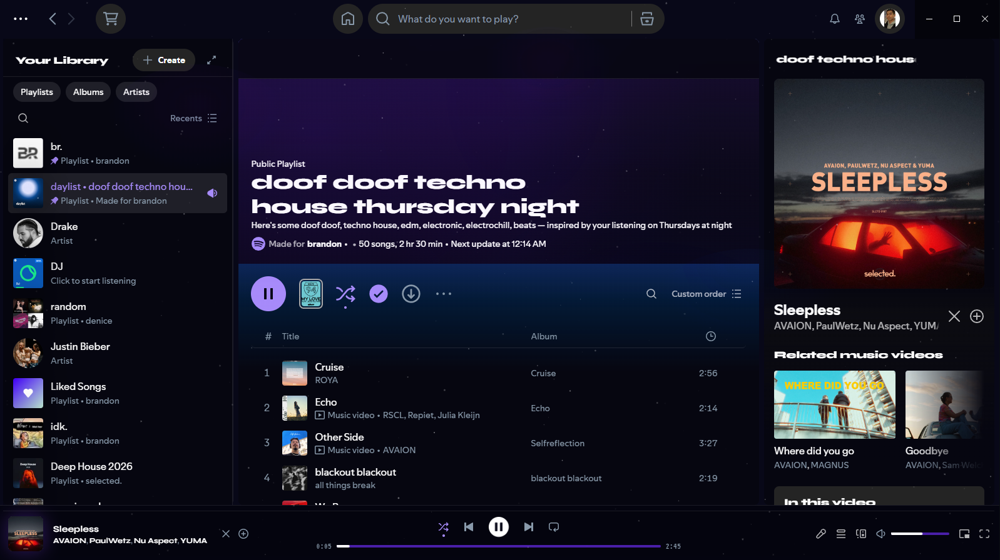

# void.

> a spicetify theme for those who listen in the dark.

deep space aesthetic with animated stars, glass cards, and a purple accent palette. built on the ziro base.

---

## preview

> 

---

## features

- animated starfield + shooting stars via extension
- glass morphism cards with purple hover glow
- deep space background with nebula pockets
- syne for headings · fira code for artists · vt323 for timestamps
- purple progress track with white fill
- purple play button with soft glow
- glass sidebar, topbar, and now playing bar
- purple scrollbar accent
- quick access grid with glass treatment

---

## install

**requirements**
- [spicetify](https://spicetify.app)
- spotify desktop

**steps**

```bash
# 1. navigate to your themes folder
cd "$(spicetify -c | xargs dirname)/Themes"

# 2. clone the repo
git clone https://github.com/buhhhrandon/void-spicetify void

# 3. copy the extension
cp void/void-stars.js "$(spicetify -c | xargs dirname)/Extensions/"

# 4. apply
spicetify config current_theme void color_scheme void
spicetify config extensions void-stars.js
spicetify apply
```

**manual install**

1. download the repo as a zip
2. extract and drop the `void` folder into `%appdata%\spicetify\Themes\` (windows) or `~/.config/spicetify/Themes/` (mac/linux)
3. drop `void-stars.js` into `%appdata%\spicetify\Extensions\`
4. run the commands above from step 4

---

## color scheme

| role | hex |
|------|-----|
| background | `#060610` |
| sidebar | `#080818` |
| accent | `#7c3aed` |
| accent light | `#a78bfa` |
| text | `#ffffff` |
| subtext | `#8899aa` |

---

## fonts

the theme imports these from google fonts automatically — no manual install needed.

- [syne](https://fonts.google.com/specimen/Syne) — headings
- [fira code](https://fonts.google.com/specimen/Fira+Code) — artist names
- [vt323](https://fonts.google.com/specimen/VT323) — timestamps

---

## notes

- built and tested on **ziro** — other base themes may need adjustments
- the stars extension uses `requestAnimationFrame` for smooth animation
- progress bar colors are applied via js to override spotify's internal renderer

---

## license

mit — do whatever you want with it.
